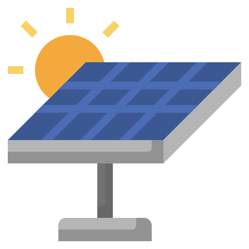
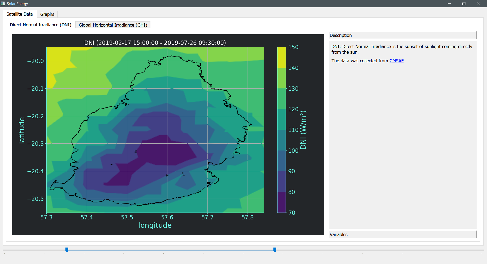

<!-- Improved compatibility of back to top link: See: https://github.com/othneildrew/Best-README-Template/pull/73 -->
<a name="readme-top"></a>
<!--
*** Thanks for checking out the Best-README-Template. If you have a suggestion
*** that would make this better, please fork the repo and create a pull request
*** or simply open an issue with the tag "enhancement".
*** Don't forget to give the project a star!
*** Thanks again! Now go create something AMAZING! :D
-->


<!-- PROJECT SHIELDS -->
<!--
*** I'm using markdown "reference style" links for readability.
*** Reference links are enclosed in brackets [ ] instead of parentheses ( ).
*** See the bottom of this document for the declaration of the reference variables
*** for contributors-url, forks-url, etc. This is an optional, concise syntax you may use.
*** https://www.markdownguide.org/basic-syntax/#reference-style-links
-->
[![Contributors][contributors-shield]][contributors-url]
[![Forks][forks-shield]][forks-url]
[![Stargazers][stars-shield]][stars-url]
[![Issues][issues-shield]][issues-url]
[![MIT License][license-shield]][license-url]
[![LinkedIn][linkedin-shield]][linkedin-url]


<!-- PROJECT LOGO -->
<br />
<div align="center">
  <a href="https://github.com/Apoorva64/mauritius-solar-pannel-placement-analysis">
    
  </a>

<h3 align="center">Mauritius solar panel placement analysis</h3>

  <p align="center">
    A project to analyse the best location for solar panels in Mauritius
    <br />
    <a href="https://github.com/Apoorva64/mauritius-solar-pannel-placement-analysis"><strong>Explore the docs »</strong></a>
    <br />
    <br />
    <a href="https://github.com/Apoorva64/mauritius-solar-pannel-placement-analysis">View Demo</a>
    ·
    <a href="https://github.com/Apoorva64/mauritius-solar-pannel-placement-analysis/issues">Report Bug</a>
    ·
    <a href="https://github.com/Apoorva64/mauritius-solar-pannel-placement-analysis/issues">Request Feature</a>
  </p>
</div>


<!-- TABLE OF CONTENTS -->
<details>
  <summary>Table of Contents</summary>
  <ol>
    <li>
      <a href="#about-the-project">About The Project</a>
      <ul>
        <li><a href="#built-with">Built With</a></li>
      </ul>
    </li>
    <li>
      <a href="#getting-started">Getting Started</a>
      <ul>
        <li><a href="#prerequisites">Prerequisites</a></li>
        <li><a href="#installation">Installation</a></li>
      </ul>
    </li>
    <li><a href="#usage">Usage</a></li>
    <li><a href="#roadmap">Roadmap</a></li> 
    <li><a href="#contributing">Contributing</a></li>
    <li><a href="#license">License</a></li>
    <li><a href="#contact">Contact</a></li>
    <li><a href="#acknowledgments">Acknowledgments</a></li>
  </ol>
</details>


<!-- ABOUT THE PROJECT -->

## About The Project

This is a project to analyse the best location for solar panels in Mauritius.
<p align="right">(<a href="#readme-top">back to top</a>)</p>

### Built With

* [Python](https://www.python.org/)
* [Jupyter Notebook](https://jupyter.org/)
* [Pandas](https://pandas.pydata.org/)
* [Numpy](https://numpy.org/)
* [Matplotlib](https://matplotlib.org/)
* [Pvlib](https://pvlib-python.readthedocs.io/en/stable/)

<p align="right">(<a href="#readme-top">back to top</a>)</p>

## How do we determine the best location for solar panels in Mauritius?

The amount of sunlight collected by a PV panel depends on how well the panel orientation matches incoming sunlight.
For example, a rooftop array facing West will produce hardly any energy in the morning when the sun is in the East
because the panel can only “see” the dim part of the sky away from the sun.

As the sun comes into view and moves towards the center of the panel’s field of view, the panel will collect more and
more irradiance. This concept is what defines plane-of-array irradiance – the amount of sunlight available to be
collected at a given panel orientation. Like the three “basic” irradiance components, POA irradiance is measured in
watts per square meter.

The best orientation for a PV panel is one that maximizes the amount of sunlight it receives.

But how do we define the orientation of a PV panel? The answer is simple: we use the sun’s position in the sky.

* The azimuth is the angle between the sun and the south direction.
* The altitude is the angle between the sun and the horizon.

To find the best location and orientation for solar panels in Mauritius,
we need to calculate the plane of array irradiance for each location and orientation.
We then find the location and orientation that gives the maximum plane of array irradiance.

## 1. Data collection

GHI, DHI, and DNI are the three “basic” ways of measuring irradiance, although each of them is measured in units of
power per area (watts per square meter):

* GHI: Global Horizontal Irradiance; the total sunlight intensity falling on a horizontal plane

<p align="center">
  
</p>

* DNI: Direct Normal Irradiance; the subset of sunlight coming directly from the sun

<p align="center">
  
</p>

* DHI: Diffuse Horizontal Irradiance; the subset of sunlight falling on a horizontal plane that isn’t coming directly
  from the sun (e.g., the light that makes the sky blue)

We collected data from the following sources:

* Direct Normal Irradiance (DNI) and Global Horizontal Irradiance (GHI)
  from [CMSAF](https://wui.cmsaf.eu/safira/action/viewICDRDetails?acronym=SARAH_V002_ICDR)

The DHI is estimated from the GHI and DNI using the following formula:

```
DHI = GHI - DNI * cos(zenith angle)
```

## 2. Calculating the POA irradiance for each location and orientation

### 2.1 Calculating the Solar Position

The solar position is the position of the sun in the sky.
To calculate the solar position, we need to know the latitude, longitude, and time of the location and also the altitude
and temperature of the location but we don't have that data so we will use the default values for now.

For each location, we calculate the solar position and store it in a dataframe with HDF-STORE in
data/solar-positions/{latitude}_{longitude}.h5

### 2.2 Calculating the POA irradiance

For each location in Dataset and for each orientation, we calculate the POA irradiance with
the [perez model](https://pvlib-python.readthedocs.io/en/stable/reference/generated/pvlib.irradiance.perez.html?highlight=perez)
from the pvlib library.
As the perez model requires the solar position, we use the solar position dataframes we created in the previous step.

The data calculated is too large to store in a single file so we store it in multiple files with netCDF4 in
data/poa-irradiance/{tilt}_{azimuth}.nc

<p align="center">
  
</p>

## 3. Finding the best location and orientation for solar panels in Mauritius yearly

To find the best location and orientation for solar panels we need to calculate the transposition factor for each
location and orientation.
The Transposition Factor is the ratio of the POA irradiance on the plane, to the POA irradiance of a flat panel. I.e.
what you gain (or loose) when tilting the collector plane


<p align="center">
  
  
  
</p>

We can see that when we change the panel orientation we can only gain 1-3% more energy with a fixed panel over the year.


<p align="center">
  
</p>

By looking at the irradiance of the best location and orientation, we can see that the best location for solar panels in
Mauritius is in the north of the island with a tilt of 21° and an azimuth of 4°.

## 4. Finding the best location and orientation for solar panels in Mauritius monthly

The location and orientation of the PV panels can be further optimized by taking into account the monthly variation in
the amount of sunlight available.

<p align="center">
  
  
  
  
</p>

As we can see, the best location and orientation for solar panels in Mauritius changes from month to month.
By optimizing the location and orientation of the PV panels for each month, we can gain up to 25% more energy.


<!-- GETTING STARTED -->

## Getting Started

The project is divided into 2 parts:

* data-collection and data-analysis
* data-visualization

The data-collection and data-analysis part is in the form of multiple jupyter notebooks in the notebooks' folder.
The data-visualization part is in the form of a QT application in the visualization folder.

### Installation

1. Clone the repo
   ```sh
   git clone 
    ```
2. Download the data
   The data processed data is too large to store in the github repository so you need to download the data from
   [here](https://drive.google.com/drive/folders/1Z0Z0Z0Z0Z0Z0Z0Z0Z0Z0Z0Z0Z0Z0Z0Z?usp=sharing)
   and put it in the poa-irradiance folder.

3. Install the requirements
   ```sh
   pip install -r requirements.txt
   ```
4. Run the QT application
   ```sh
   python visualization/main.py
   ```

<!-- USAGE EXAMPLES -->

## Usage

In the visualization app you can view the different graphs and maps of the dataset.

<p align="center">
  
</p>

<p align="center">
  
</p>

<p align="right">(<a href="#readme-top">back to top</a>)</p>


<!-- CONTRIBUTING -->

## Contributing

Contributions are what make the open source community such an amazing place to learn, inspire, and create. Any
contributions you make are **greatly appreciated**.

If you have a suggestion that would make this better, please fork the repo and create a pull request. You can also
simply open an issue with the tag "enhancement".
Don't forget to give the project a star! Thanks again!

1. Fork the Project
2. Create your Feature Branch (`git checkout -b feature/AmazingFeature`)
3. Commit your Changes (`git commit -m 'Add some AmazingFeature'`)
4. Push to the Branch (`git push origin feature/AmazingFeature`)
5. Open a Pull Request

<p align="right">(<a href="#readme-top">back to top</a>)</p>


<!-- LICENSE -->

## License

Distributed under the MIT License. See `LICENSE.txt` for more information.

<p align="right">(<a href="#readme-top">back to top</a>)</p>


<!-- CONTACT -->

## Contact

Appadoo Apoorva Srinivas - apoorvaappadoo@gmail.com

Project
Link: [https://github.com/Apoorva64/mauritius-solar-pannel-placement-analysis](https://github.com/Apoorva64/mauritius-solar-pannel-placement-analysis)

<p align="right">(<a href="#readme-top">back to top</a>)</p>


<!-- ACKNOWLEDGMENTS -->

## Acknowledgments

* []()
* []()
* []()

<p align="right">(<a href="#readme-top">back to top</a>)</p>


<!-- MARKDOWN LINKS & IMAGES -->
<!-- https://www.markdownguide.org/basic-syntax/#reference-style-links -->

[contributors-shield]: https://img.shields.io/github/contributors/Apoorva64/mauritius-solar-pannel-placement-analysis.svg?style=for-the-badge

[contributors-url]: https://github.com/Apoorva64/mauritius-solar-pannel-placement-analysis/graphs/contributors

[forks-shield]: https://img.shields.io/github/forks/Apoorva64/mauritius-solar-pannel-placement-analysis.svg?style=for-the-badge

[forks-url]: https://github.com/Apoorva64/mauritius-solar-pannel-placement-analysis/network/members

[stars-shield]: https://img.shields.io/github/stars/Apoorva64/mauritius-solar-pannel-placement-analysis.svg?style=for-the-badge

[stars-url]: https://github.com/Apoorva64/mauritius-solar-pannel-placement-analysis/stargazers

[issues-shield]: https://img.shields.io/github/issues/Apoorva64/mauritius-solar-pannel-placement-analysis.svg?style=for-the-badge

[issues-url]: https://github.com/Apoorva64/mauritius-solar-pannel-placement-analysis/issues

[license-shield]: https://img.shields.io/github/license/Apoorva64/mauritius-solar-pannel-placement-analysis.svg?style=for-the-badge

[license-url]: https://github.com/Apoorva64/mauritius-solar-pannel-placement-analysis/blob/master/LICENSE.txt

[linkedin-shield]: https://img.shields.io/badge/-LinkedIn-black.svg?style=for-the-badge&logo=linkedin&colorB=555

[linkedin-url]: https://linkedin.com/in/appadoo-apoorva-srinivas-481367207

[product-screenshot]: images/screenshot.png

[Next.js]: https://img.shields.io/badge/next.js-000000?style=for-the-badge&logo=nextdotjs&logoColor=white

[Next-url]: https://nextjs.org/

[React.js]: https://img.shields.io/badge/React-20232A?style=for-the-badge&logo=react&logoColor=61DAFB

[React-url]: https://reactjs.org/

[Vue.js]: https://img.shields.io/badge/Vue.js-35495E?style=for-the-badge&logo=vuedotjs&logoColor=4FC08D

[Vue-url]: https://vuejs.org/

[Angular.io]: https://img.shields.io/badge/Angular-DD0031?style=for-the-badge&logo=angular&logoColor=white

[Angular-url]: https://angular.io/

[Svelte.dev]: https://img.shields.io/badge/Svelte-4A4A55?style=for-the-badge&logo=svelte&logoColor=FF3E00

[Svelte-url]: https://svelte.dev/

[Laravel.com]: https://img.shields.io/badge/Laravel-FF2D20?style=for-the-badge&logo=laravel&logoColor=white

[Laravel-url]: https://laravel.com

[Bootstrap.com]: https://img.shields.io/badge/Bootstrap-563D7C?style=for-the-badge&logo=bootstrap&logoColor=white

[Bootstrap-url]: https://getbootstrap.com

[JQuery.com]: https://img.shields.io/badge/jQuery-0769AD?style=for-the-badge&logo=jquery&logoColor=white

[JQuery-url]: https://jquery.com 